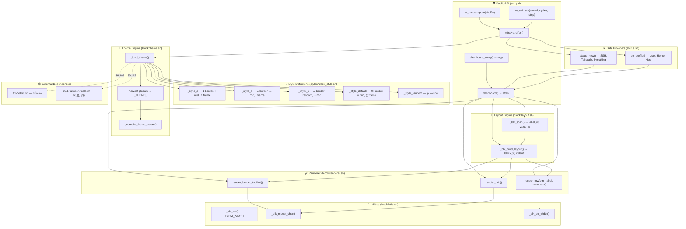

# JOE Block Engine — Architecture Guide

## โฟลเดอร์ Structure ใหม่

```
functions/joe-block/
├── entry.sh              ← Public API (dashboard, m, m_random, m_animate)
├── block/
│   ├── utils.sh          ← ค่าคงที่ + ฟังก์ชันพื้นฐาน
│   ├── layout.sh         ← คำนวณขนาด + จัดตำแหน่ง
│   ├── theme.sh          ← โหลด + compile สีจาก style
│   ├── renderer.sh       ← วาด border, row, separator
│   └── status.sh         ← Data providers (status_new, op_profile)
└── styles/
    └── block_style.sh    ← นิยาม style ทั้งหมด (a/b/c/default/random)
```

## แผนผังการทำงาน (Data Flow)

```
┌─────────────────────────────────────────────────────────────┐
│                     USER เรียก m a                          │
│                     (หรือ m_random, m_animate)               │
└──────────────────────┬──────────────────────────────────────┘
                       │
                       ▼
┌──────────────────────────────────────────────────────────────┐
│  entry.sh — m()                                              │
│  ┌─────────────────────────────────────────────────────────┐ │
│  │ 1. parse args → style="a", offset=""                   │ │
│  │ 2. _load_theme("a", "")                                │ │
│  │ 3. dispatch data provider (status_new / op_profile)    │ │
│  └─────────────────────────────────────────────────────────┘ │
└──────────┬───────────────────────────────┬───────────────────┘
           │                               │
           ▼                               ▼
┌─────────────────────┐     ┌──────────────────────────────────┐
│  styles/            │     │  block/status.sh                 │
│  block_style.sh     │     │  ┌────────────────────────────┐  │
│  ┌────────────────┐ │     │  │ status_new()               │  │
│  │ _style_a()     │ │     │  │  - เช็ค SSH, Tailscale     │  │
│  │ _style_b()     │ │     │  │  - เช็ค Syncthing, Acode-X │  │
│  │ _style_c()     │ │     │  │  - สร้าง ROWS array        │  │
│  │ _style_default │ │     │  │  - เรียก dashboard_array   │  │
│  │ _style_random  │ │     │  └─────────────┬──────────────┘  │
│  └────────────────┘ │     │                │                  │
│  ใช้ set_() เขียน   │     └────────────────┼──────────────────┘
│  ตัวแปร全局ทั้งหมด    │                      │
└──────────┬──────────┘                      │
           │                                 │
           ▼                                 ▼
┌──────────────────────────────────────────────────────────────┐
│  block/theme.sh — _load_theme()                              │
│  ┌─────────────────────────────────────────────────────────┐ │
│  │ 1. source 01-colors.sh (ถ้ายังไม่ loaded)             │ │
│  │ 2. source 00.1-function-tools.sh (bc_(), tp())         │ │
│  │ 3. source styles/block_style.sh                        │ │
│  │ 4. เรียก _style_a() → set_() เขียนตัวแปร全局          │ │
│  │ 5. harvest ตัวแปร全局 → _THEME[] associative array     │ │
│  │ 6. _compile_theme_colors() → สร้างสีสำเร็จรูป          │ │
│  └─────────────────────────────────────────────────────────┘ │
│                                                              │
│  _THEME[] = {                                                │
│    border_char, frame_char, mid_line,                        │
│    row_frame_l/r, mid_frame_l/r,                             │
│    top_border, bot_border, mid_sep,                          │
│    label_c, value_c,  ← color specs                          │
│    cc_bt, cc_bb, cc_ml, cc_row_fl/fr    ← compiled colors   │
│  }                                                           │
└──────────────────────────────┬───────────────────────────────┘
                               │
                               ▼
┌──────────────────────────────────────────────────────────────┐
│  dashboard() — ประกอบร่างทุกอย่าง                              │
│  ┌─────────────────────────────────────────────────────────┐ │
│  │ 1. _blk_scan(ROWS) → หา label_w, value_w สูงสุด       │ │
│  │ 2. _blk_build_layout(offset)                           │ │
│  │    → คำนวณ block_w, indent (centering)                  │ │
│  │ 3. render_border_top()     ──┐                          │ │
│  │ 4. for each row:            │  block/layout.sh          │ │
│  │    render_row(eml,l,v,emr)  ├── block/utils.sh          │ │
│  │    render_mid()             │  (ค่าคงที่ EMO_L, PAD_X)  │ │
│  │ 5. render_border_bot()     ──┘                          │ │
│  └─────────────────────────────────────────────────────────┘ │
└──────────────────────────────┬───────────────────────────────┘
                               │
                               ▼
┌──────────────────────────────────────────────────────────────┐
│  block/renderer.sh — วาดผลลัพธ์                               │
│  ┌─────────────────────────────────────────────────────────┐ │
│  │ render_border_top/bot()                                 │ │
│  │   → repeat _THEME[cc_bt] x _LAYOUT[block_w]            │ │
│  │                                                         │ │
│  │ render_row(eml, label, value, emr)                      │ │
│  │   → [pad][frame_l][eml_pad][label][sep][value][emr_pad] │ │
│  │     [frame_r]                                            │ │
│  │   → ใช้ _LAYOUT[label_w/value_w] จัดช่องเท่ากัน        │ │
│  │                                                         │ │
│  │ render_mid()                                            │ │
│  │   → [frame_l][repeat(mid_line)][frame_r]                │ │
│  └─────────────────────────────────────────────────────────┘ │
└──────────────────────────────────────────────────────────────┘
```

## แผนผัง Modular Architecture



## ไฟล์ที่เกี่ยวข้องนอก joe-block/

| ไฟล์ | ความสัมพันธ์ | หมายเหตุ |
|------|-------------|---------|
| `01-colors.sh` | 🔴 dependency | ต้อง loaded ก่อน — มี `color()`, `rc()`, `rc1()` |
| `functions/00.1-function-tools.sh` | 🟡 dependency | มี `bc_()`, `tp()` สำหรับคำนวณ offset |
| `functions/00-fm-loader.sh` | 🟢 loader | source `block_style.sh` ตอน startup |
| `tools/ai_block.sh` | 🔵 integration | AI status block ใช้ engine เดียวกัน |
| `lessons/test_m_animate.sh` | ⚪ test | ทดสอบ m_animate |

## วิธีใช้งาน

```bash
# Source engine
source ~/ssot/functions/joe-block/entry.sh

# แสดง status block (style default)
m

# แสดงด้วย style a
m a

# แสดงด้วย style b + เลื่อนขวา 5 คอลัมน์
m b -5

# สุ่ม style (มีซ้ำ)
m_random pure

# สุ่ม style (ไม่ซ้ำจนครบ loop)
m_random s

# แสดง animation ping-pong
m_animate          # default: speed=0.05, cycles=3, step=3
m_animate 0.03 5 2 # เร็วขึ้น, 5 รอบ, 2 คอลัมน์/frame

# Pipeline — ส่งข้อมูลเอง
echo "🌟|LABEL|value|🌟" | dashboard

# Array — ส่งข้อมูลเป็น args
dashboard_array "🌟|LABEL1|val1|🌟" "⭐|LABEL2|val2|⭐"
```

## Style ที่มี

| Style | Border | Mid-line | Frame | Data | Offset |
|-------|--------|----------|-------|------|--------|
| `default` | ▨ (random color) | = | ⟨⟩ | status_new | center |
| `a` | ◙ (random color) | ◌ | ⇬ | status_new | tp/4 |
| `b` | ▰ (white bold) | ▭ | ¦ | status_new | tp/2 |
| `c` | ▰ (random color) | ▱ | \|▯ | op_profile | left |
| `random` | สุ่ม | สุ่ม | สุ่ม | status_new | สุ่ม |
